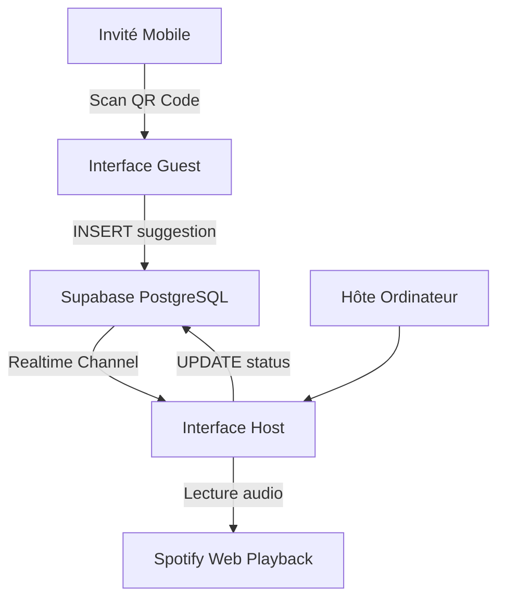

# 🏗️ ARCHITECTURE TECHNIQUE - VIBE CONTROL

## 📊 Vue d'Ensemble



## 🗂️ Structure des Dossiers

```
VibeControl/
│
├── 📁 app/                      # Next.js App Router
│   ├── layout.tsx               # Layout global (font, metadata)
│   ├── page.tsx                 # Landing page
│   ├── globals.css              # Styles Tailwind + animations
│   │
│   ├── 📁 host/                 # Route /host (protégée)
│   │   └── page.tsx             # Page création/gestion session
│   │
│   └── 📁 guest/
│       └── 📁 [sessionId]/      # Route dynamique /guest/:id
│           └── page.tsx         # Interface suggestion invité
│
├── 📁 components/               # Composants React réutilisables
│   ├── HostDashboard.tsx        # ⭐ Cœur Realtime (2 colonnes)
│   ├── SessionHeader.tsx        # QR Code + Info session
│   ├── MusicSearch.tsx          # Barre recherche + résultats
│   └── GuestSubmission.tsx      # Formulaire suggestion invité
│
├── 📁 lib/                      # Utilitaires partagés
│   └── supabase.ts              # Client Supabase + Types TS
│
├── 📁 supabase/                 # Scripts Backend
│   ├── schema.sql               # ⚙️ Création tables + RLS + triggers
│   └── README.md                # Doc architecture BD
│
├── 📁 public/                   # Assets statiques
│   └── manifest.json            # Config PWA
│
├── tailwind.config.ts           # Thème Dark + Neon customs
├── tsconfig.json                # Config TypeScript
├── next.config.js               # Config Next.js (domaines images)
├── package.json                 # Dépendances npm
├── .env.local.example           # Template variables
├── .gitignore
├── README.md                    # Doc complète
└── QUICKSTART.md                # Guide rapide 5min
```

## 🔄 Flow Applicatif

### 1. Création Session (Host)

```
User /host
  → SignIn Anonyme (Supabase Auth)
  → Créer Session (INSERT sessions)
  → Générer QR Code (URL: /guest/:sessionId)
  → Écoute Realtime (subscribe channel)
```

### 2. Suggestion (Guest)

```
User scan QR Code
  → Page /guest/:sessionId
  → Recherche musicale (Mock Data / future: Spotify API)
  → Sélection morceau
  → INSERT tracks (status='pending')
  → Notification Realtime → Host
```

### 3. Modération (Host)

```
Host reçoit notification
  → Affichage colonne "En Attente"
  → Click "Valider"
    → UPDATE tracks SET status='approved'
    → Trigger auto-increment order_index
    → Realtime → Déplacement vers "Playlist Active"
  → Click "Refuser"
    → UPDATE tracks SET status='rejected'
    → Disparaît de la vue
```

## 🗄️ Modèle de Données

### Table: `sessions`

```sql
id            UUID        PK, auto-generated
host_id       UUID        FK → auth.users
name          VARCHAR     Nom de la session
created_at    TIMESTAMP   Horodatage création
is_active     BOOLEAN     true = en cours, false = terminée
ended_at      TIMESTAMP   Nullable
```

**Index :**

- `idx_sessions_host_id` (host_id)
- `idx_sessions_is_active` (is_active)

### Table: `tracks`

```sql
id            UUID        PK, auto-generated
session_id    UUID        FK → sessions(id) CASCADE
title         VARCHAR     Nom du morceau
artist        VARCHAR     Artiste
album         VARCHAR     Optionnel
cover_url     TEXT        URL pochette
spotify_id    VARCHAR     ID Spotify pour lecture
suggested_by  VARCHAR     Prénom/pseudo invité
status        VARCHAR     'pending' | 'approved' | 'rejected' | 'played'
created_at    TIMESTAMP   Horodatage suggestion
order_index   INTEGER     Position dans playlist (auto-incrémenté)
played_at     TIMESTAMP   Nullable (future: historique)
```

**Index :**

- `idx_tracks_session_id` (session_id)
- `idx_tracks_status` (status)
- `idx_tracks_session_status` (session_id, status) - Composite

**Contraintes :**

- `CHECK (status IN ('pending', 'approved', 'rejected', 'played'))`

## 🔐 Sécurité (Row Level Security)

### Philosophie

- **Hôte** : Contrôle total sur ses sessions et tracks
- **Invités** : Lecture publique + insertion limitée (pending)
- **Anonymes** : Peuvent suggérer sans compte

### Politiques RLS

#### `sessions`

```sql
-- Host peut tout faire
CREATE POLICY "Host can manage own sessions"
ON sessions FOR ALL
USING (auth.uid() = host_id);

-- Lecture publique des sessions actives (pour QR Code)
CREATE POLICY "Anyone can read active sessions"
ON sessions FOR SELECT
USING (is_active = true);
```

#### `tracks`

```sql
-- Host peut gérer tracks de ses sessions
CREATE POLICY "Host can manage tracks in own sessions"
ON tracks FOR ALL
USING (session_id IN (
  SELECT id FROM sessions WHERE host_id = auth.uid()
));

-- Lecture publique (affichage Guest)
CREATE POLICY "Anyone can read tracks in active sessions"
ON tracks FOR SELECT
USING (session_id IN (
  SELECT id FROM sessions WHERE is_active = true
));

-- Insertion libre (status=pending UNIQUEMENT)
CREATE POLICY "Anyone can suggest tracks"
ON tracks FOR INSERT
WITH CHECK (
  status = 'pending' AND
  session_id IN (SELECT id FROM sessions WHERE is_active = true)
);
```

## ⚡ Realtime Supabase

### Activation

```sql
-- Dans Dashboard: Database > Replication > Enable "tracks"
```

### Implémentation Client (Host)

```typescript
useEffect(() => {
  const channel = supabase
    .channel(`session-${sessionId}`)
    .on(
      "postgres_changes",
      {
        event: "*", // INSERT, UPDATE, DELETE
        schema: "public",
        table: "tracks",
        filter: `session_id=eq.${sessionId}`,
      },
      handleRealtimeUpdate,
    )
    .subscribe();

  return () => supabase.removeChannel(channel);
}, [sessionId]);
```

### Gestion des Événements

```typescript
const handleRealtimeUpdate = (payload) => {
  switch (payload.eventType) {
    case "INSERT":
      // Nouvelle suggestion → Ajouter à pendingTracks
      break;
    case "UPDATE":
      // Changement de status → Déplacer entre colonnes
      break;
    case "DELETE":
      // Suppression → Retirer de la liste
      break;
  }
};
```

## 🎨 Design System

### Thème Couleurs

```css
--dark-bg: #0a0a0f (Fond principal) --dark-card: #1a1a24 (Cartes/cadres)
  --neon-violet: #9d4edd (Accent primaire) --neon-cyan: #00d9ff
  (Accent secondaire);
```

### Classes Utilitaires Custom

```css
.btn-neon              → Bouton avec effet néon
.neon-glow-violet      → Ombre portée violette
.neon-glow-cyan        → Ombre portée cyan
.animate-pulse-neon    → Pulsation lumineuse
.animate-slide-in      → Apparition latérale
```

### Responsive Breakpoints (Tailwind)

```
sm: 640px   (Mobile large)
md: 768px   (Tablette)
lg: 1024px  (Desktop)
xl: 1280px  (Large screen)
```

## 🔧 Triggers PostgreSQL

### Auto-increment `order_index`

```sql
CREATE FUNCTION set_order_index()
RETURNS TRIGGER AS $$
BEGIN
  IF NEW.status = 'approved' AND NEW.order_index IS NULL THEN
    -- Auto-incrémente pour ordre dans playlist
    SELECT COALESCE(MAX(order_index), 0) + 1
    INTO NEW.order_index
    FROM tracks
    WHERE session_id = NEW.session_id
    AND status = 'approved';
  END IF;
  RETURN NEW;
END;
$$ LANGUAGE plpgsql;

CREATE TRIGGER trigger_set_order_index
BEFORE INSERT OR UPDATE ON tracks
FOR EACH ROW
EXECUTE FUNCTION set_order_index();
```

## 🚀 Performance & Optimisations

### Indexation BD

- Index composites pour queries fréquentes
- Réplication Realtime limitée à table `tracks` uniquement

### Frontend

- Server Components par défaut (Next.js 14)
- Client Components uniquement pour interactivité
- Lazy loading images (Next/Image)
- Debouncing sur recherche (future)

### Realtime

- Filtrage côté serveur (`filter: session_id=eq.xxx`)
- Un seul channel par session
- Unsubscribe automatique (cleanup dans useEffect)

## 📱 Progressive Web App

### Fichier Manifest

```json
{
  "name": "Vibe Control",
  "short_name": "VibeCtrl",
  "display": "standalone", // Plein écran
  "theme_color": "#9D4EDD", // Barre navigation
  "background_color": "#0A0A0F"
}
```

### Installation Mobile

- iOS : Partager > Ajouter à l'écran d'accueil
- Android : Navigation > Installer l'application

## 🔌 Intégrations Futures

### Spotify Web Playback SDK

```typescript
// À implémenter dans HostDashboard.tsx
const player = new Spotify.Player({
  name: "Vibe Control",
  getOAuthToken: (cb) => cb(token),
});

player.connect();
player.addListener("player_state_changed", handlePlayback);
```

### API Spotify Search

```typescript
// Remplacer MusicSearch.tsx mock data
const searchTracks = async (query: string) => {
  const response = await fetch(
    `https://api.spotify.com/v1/search?q=${query}&type=track`,
    { headers: { Authorization: `Bearer ${token}` } },
  );
  return response.json();
};
```

## 📊 Monitoring (Recommandations)

### Métriques à surveiller

- Nombre de sessions actives simultanées
- Latence Realtime (INSERT → Notification)
- Taux de validation/rejet des suggestions
- Erreurs d'insertion (RLS violations)

### Outils suggérés

- Supabase Dashboard Analytics
- Vercel Analytics (si déployé)
- Sentry (error tracking)

## 🧪 Testing Strategy

### Tests Manuels Critiques

1. **Realtime Sync** : Ouvrir 2 navigateurs, tester délai
2. **RLS** : Tenter UPDATE depuis Guest (doit échouer)
3. **Triggers** : Vérifier order_index auto-incrémenté
4. **Responsive** : Tester mobile (Chrome DevTools)

### Tests Automatisés (Future)

- Unit tests : Composants React (Jest/Vitest)
- Integration tests : Routes API (Playwright)
- E2E : Flow complet Host → Guest (Cypress)

---

## 📚 Ressources Complémentaires

- [Next.js 14 Docs](https://nextjs.org/docs)
- [Supabase Realtime](https://supabase.com/docs/guides/realtime)
- [Tailwind CSS](https://tailwindcss.com/docs)
- [Spotify Web API](https://developer.spotify.com/documentation/web-api)
- [PWA Checklist](https://web.dev/pwa-checklist/)

---

**🎯 Cette architecture permet une scalabilité jusqu'à ~100 invités par session avec un temps de latence Realtime <500ms.**
